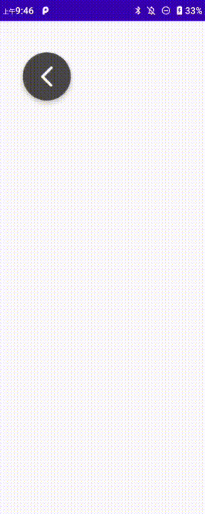

# DraggableHelper

设置一个view可以全局浮动显示，全局拖动，自动吸附到屏幕边缘


### 使用

```java
View view = LayoutInflater.from(context).inflate(R.layout.layout_float_toolbar, null);
DraggableHelper draggableHelper = new DraggableHelper(context);
// 设置view可以全局浮动显示和拖动
draggableHelper.setDraggableView(view)
        // 设置view的初始位置
        .setInitPosition(50, 80)
        // 设置可以拖动的区域
        .setDisplayRect(new Rect(0, 0, 1920, 1080))
        // 设置是否自动吸附到屏幕边缘
        .setAutoFlipToEdge(true);
draggableHelper.start();


// 应用销毁时，调用stop释放资源
draggableHelper.stop();

```

### 效果


